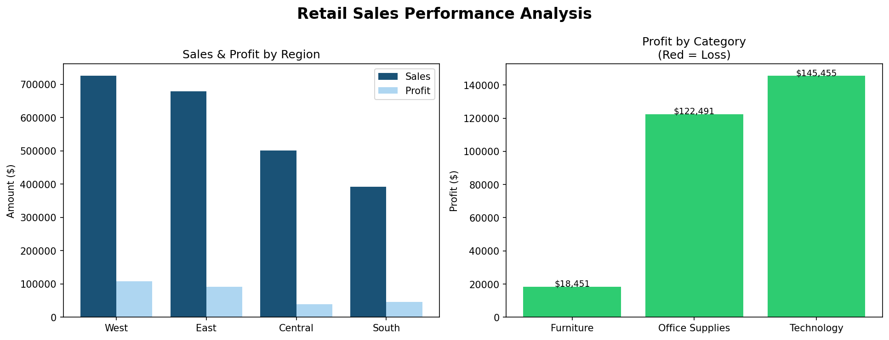
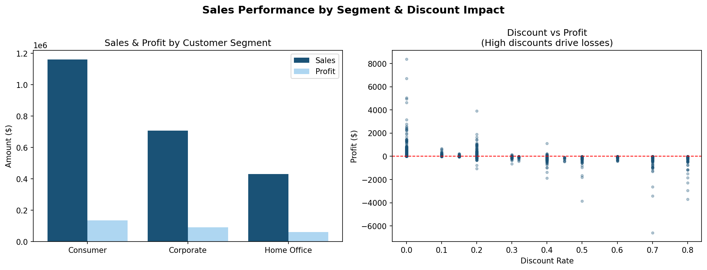
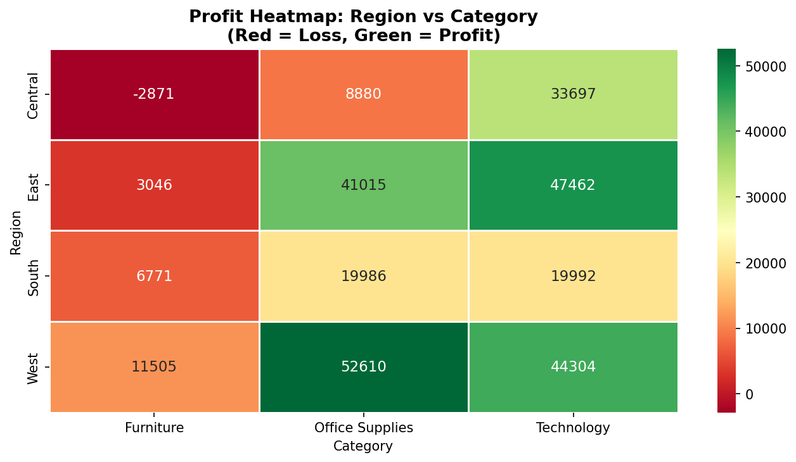
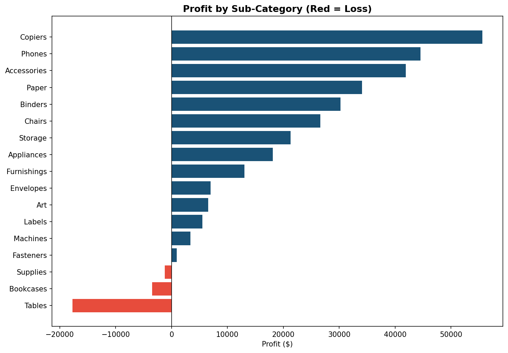

# 🛒 Retail Sales Performance Analysis


> Analyzing 9,994 retail orders to uncover profit drivers, underperforming segments, and actionable business recommendations using Exploratory Data Analysis.

---

## 📌 Problem Statement

Retail businesses often struggle to identify **which regions, categories, and customer segments are actually profitable** versus those that generate high sales but low or negative margins.

This project digs into a US retail dataset to answer:
- Which regions and categories drive the most profit?
- Where is the business losing money despite high sales?
- Does discounting strategy hurt profitability?

---

## 📊 Dataset

| Property | Details |
|----------|---------|
| Source | [Sample Superstore Dataset — Kaggle](https://www.kaggle.com/datasets/vivek468/superstore-dataset-final) |
| Records | 9,994 orders |
| Features | 13 columns (Region, Category, Segment, Sales, Profit, Discount, etc.) |
| Geography | 4 US Regions — West, East, Central, South |

---

## 🔧 Tech Stack

- **Language:** Python 3.10
- **Data Analysis:** Pandas, NumPy
- **Visualization:** Matplotlib, Seaborn
- **Environment:** Google Colab / Jupyter Notebook

---

## 🚀 Project Workflow

```
1. Data Loading & Exploration
        ↓
2. Business Overview (Total Sales, Profit, Margin)
        ↓
3. Region & Category Analysis
        ↓
4. Customer Segment & Discount Impact Analysis
        ↓
5. Profit Heatmap (Region × Category)
        ↓
6. Sub-Category Profit Breakdown
        ↓
7. Key Findings & Business Recommendations
```

---

## 📈 Key Numbers

| Metric | Value |
|--------|-------|
| Total Sales | $2,297,200 |
| Total Profit | $286,397 |
| Profit Margin | 12.47% |
| Total Orders | 9,994 |
| Regions | 4 |
| Categories | 3 |

---

## 🔍 Key Findings

- **West region** generates the highest profit; **Central region** is the weakest performer
- **Furniture category generates a net loss in the Central region** ($-2,871) despite strong sales volume — a critical pricing issue
- **Tables** ($-17,725) and **Bookcases** ($-3,472) are the top loss-making sub-categories across all regions
- **High discounts (>40%) consistently result in negative profit** — the current discount strategy is eroding margins
- **Consumer segment** drives the most revenue; **Corporate segment** delivers better profit margins per order
- **Technology category** is the most profitable across all regions

---

## 📉 Visualizations

### Region & Category Performance


### Segment & Discount Impact


### Profit Heatmap


### Sub-Category Profit Breakdown


---

## 💡 Business Recommendations

> 1. **Reprice or discontinue Tables and Bookcases** in the Central region — they generate losses despite consistent demand
> 2. **Cap discount rates at 30%** — orders with discounts above 40% almost always result in negative profit
> 3. **Focus marketing efforts on Technology** — highest profit margins across all regions and segments
> 4. **Invest in West region expansion** — consistently the highest performing region across all categories

---

## 📁 Repository Structure

```
retail-sales-analysis/
│
├── retail_sales_analysis.ipynb   # Main analysis notebook
├── SampleSuperstore.csv          # Dataset
├── region_category.png           # Region & Category charts
├── segment_discount.png          # Segment & Discount analysis
├── profit_heatmap.png            # Profit heatmap
├── subcategory_profit.png        # Sub-category breakdown
└── README.md                     # Project documentation
```

---

## ▶️ How to Run

1. Clone this repository
```bash
git clone https://github.com/0jasbansal/retail-sales-analysis.git
```

2. Open `retail_sales_analysis.ipynb` in [Google Colab](https://colab.research.google.com) or Jupyter Notebook

3. Upload `SampleSuperstore.csv` to the working directory

4. Run all cells: **Runtime → Run All**

---

## 👤 Author

**Aditya Rathi**  
B.Tech — Computer Science Engineering, MAIT Delhi  
[LinkedIn](https://linkedin.com/in/aditya-rathi05) · [GitHub](https://github.com/AdityaRathi05)

---

*This project was built as part of my data analytics portfolio targeting analytics and AI roles.*
